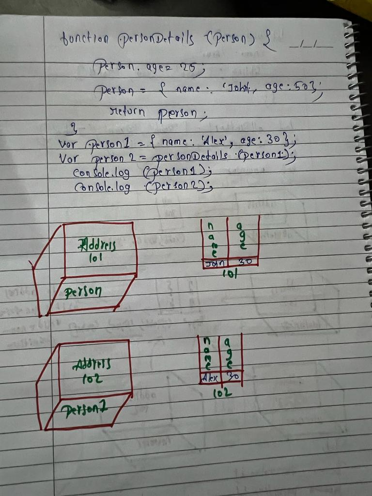

1. What will be the output and explain the reason.

```js
let obj = { name: 'Arya' };
obj = { surname: 'Stark' };
let newObj = { name: 'Arya' };
let user = obj;
let arr = ['Hi'];
let arr2 = arr;
```

Answer the following with reason after going through the above code:

- `[10] === [10]`
- What is the value of obj? // answer { surname: 'Stark' }
- `obj == newObj` // false  have different values
- `obj === newObj` //  false  have different values
- `user === newObj` //false  have different values
- `user == newObj`// false  have different values
- `user == obj` // true copy by reference
- `arr == arr2` // true copy by reference
- `arr === arr2`// true copy by reference

2. What's will be the value of `person1` and `person2` ? Explain with reason. Draw the memory representation diagram.
  person1 will have the name:alex age:30 and person2 is undefined 
<!-- To add this image here use  -->

```js
function personDetails(person) {
  person.age = 25;
  person = { name: 'John', age: 50 };
  return person;
}
var person1 = { name: 'Alex', age: 30 };
var person2 = personDetails(person1);
console.log(person1);
console.log(person2);
```

3. What will be the output of the below code:

```js
var brothers = ['Bran', 'John'];
var user = {
  name: 'Sansa',
};
user.brothers = brothers;
brothers.push('Robb');
console.log(user.brothers === brothers); //1. output true its a copy by refence and the updated value through push is added and its true
console.log(user.brothers.length === brothers.length); //2. output true its a copy by refence  has same address
```
